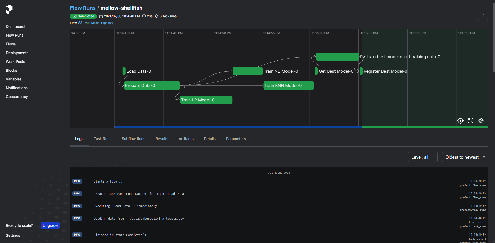
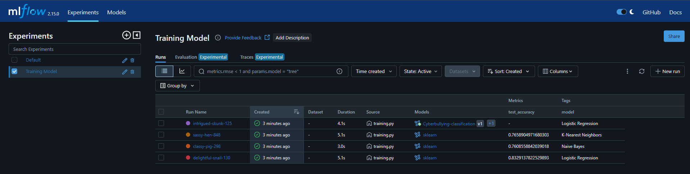
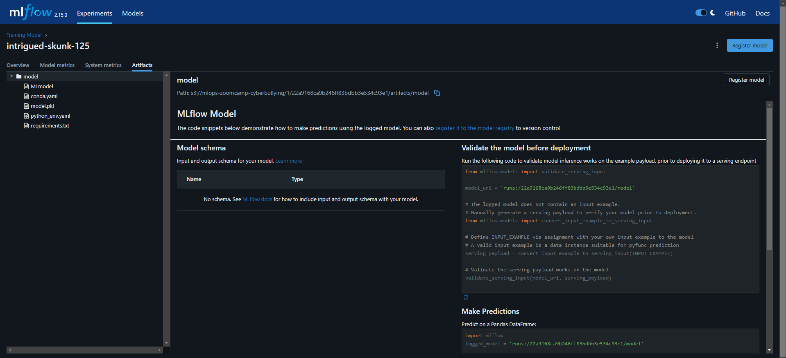
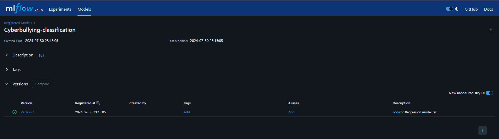
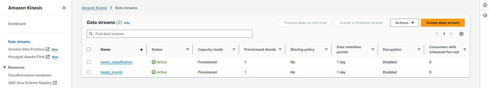

# Cyberbullying Detection

An end-to-end machine learning project with Terraform, MLflow, Prefect, Docker, AWS (EC2, Lambda, S3, Kinesis, ECR, IAM), Evidently AI, Grafana and much more!

## Description

### Problem

A growing number of people across all age groups use social media, and most depend on it as their primary means of daily contact. Because social media is so widely used, cyberbullying can affect anybody at any time or place. Because it is more anonymous online, it is more challenging to eliminate than conventional bullying.

In reaction to the increased risk of cyberbullying during the COVID-19 epidemic brought on by extensive school closures, more screen usage, and less in-person social interaction, UNICEF issued a [warning](https://www.unicef.org/press-releases/children-increased-risk-harm-online-during-global-covid-19-pandemic) on April 15, 2020. The statistics on cyberbullying are incredibly concerning: 87% of middle and high school kids have witnessed cyberbullying, and 36.5% of them have experienced it themselves. The impacts of cyberbullying can range from depressive symptoms to suicidal thoughts.

This project intends to promote proactive efforts towards combatting this by creating models to automatically flag potentially harmful tweets and break down the patterns of hatred.

### Objective

The project will create a stream Machine Learning Operations (MLOps) pipeline that processes the tweet data. The data will be retrieved from tweet API, sent to AWS Lambda to process. The Lambda function will retrieve model artifacts from AWS S3, and perform the classification, return the class of tweets to the classification streams. System can consume this classification stream to flag potentially harmful tweets and send warnings to users. 

### Dataset

The tweets data which will be used to train the machine learning model is obtained from [Kaggle](https://www.kaggle.com/datasets/andrewmvd/cyberbullying-classification/). Over 47,000 tweets have been categorized in this dataset based on the following categories: Age, Ethnicity, Gender, Religion, Other sort of cyberbullying, and Not cyberbullying. There are about 8,000 of each class in the data since it has been balanced. **Warning:** You should only read these tweets to the extent that you feel safe because they either depict bullying incidents or are the offense itself. 

### Tools & Technologies

- Cloud - [**Amazon Web Services**](https://aws.amazon.com/)
- Virtual machine - [**Amazon EC2**](https://aws.amazon.com/ec2/)
- Infrastructure as Code software - [**Terraform**](https://www.terraform.io)
- Containerization - [**Docker**](https://www.docker.com) and [**Docker Compose**](https://docs.docker.com/compose/)
- Orchestration - [**Prefect**](https://www.prefect.io/)
- Experiment tracking and model management - [**MLflow**](https://mlflow.org/)
- Model artifacts storage - [**Amazon S3**](https://aws.amazon.com/s3/)
- Streaming model deployment - [**AWS Lambda**](https://aws.amazon.com/lambda/) and [**Amazon Kinesis**](https://aws.amazon.com/kinesis/)
- Container storage - [**Amazon ECR**](https://aws.amazon.com/ecr/)
- Model monitoring - [**Evidently AI**](https://www.evidentlyai.com/) and [**Grafana**](https://grafana.com/)
- Language - [**Python**](https://www.python.org)

### Architecture

### Exploratory Data Analysis and Modeling
The exploratory data analysis and modeling is done in the `notebooks` directory. The exploratory data analysis is done in the [exploratory-data-analysis.ipynb](notebooks/exploratory-data-analysis.ipynb) notebook. The modeling is done in the [modeling.ipynb](notebooks/modeling.ipynb) notebook.

### Training Pipeline

### Experiment Tracking & Model Registry

### Model Storage

### Streaming Deployment

### Container Image Storage

### Model Monitoring

## Setup

**WARNING: You will be charged for all the infra setup. You can try free trials or 12 months free tier on AWS.**
### Pre-requisites

If you already have an Amazon Web Services account, you can skip the pre-requisite steps.

- Amazon Web Services: [AWS Account and Access Setup](setup/1_aws.md)

### Get Going

- SSH into your Virtual Machine - [Setup](setup/2_ssh.md)
- Procure infrastructure on AWS with Terraform - [Setup](setup/3_terraform.md)
- Setup Prefect and MLflow on Virtual Machine to trigger the training pipeline - [Setup](setup/4_prefect_mlflow.md)
- Streaming deployment - [Setup](setup/5_streaming.md)
- Monitoring - [Setup](setup/6_monitoring.md)
- Testing, Code Formatting and Pre-commit hooks - [Setup](setup/7_best_practices.md)

### Further Improvement

- Include CI/CD

### Special Mentions
I'd like to thank the [DataTalks.Club](https://datatalks.club) for offering this MLOps course for completely free. All the things I learnt there, enabled me to come up with this project. If you want to develop skill on MLOps technologies, please check out the [course](https://github.com/DataTalksClub/mlops-zoomcamp).