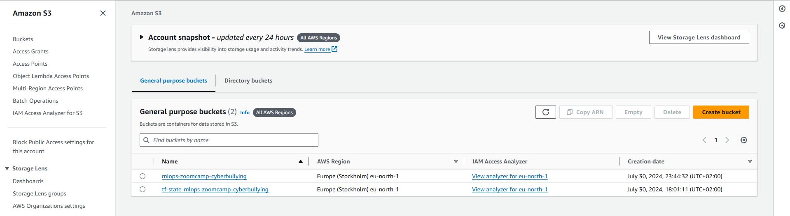
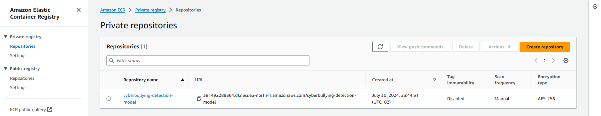
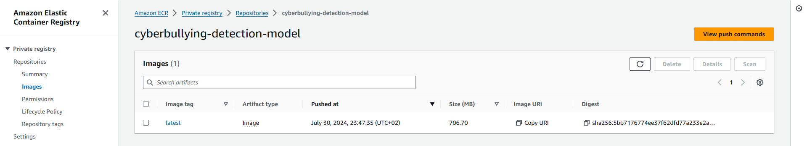
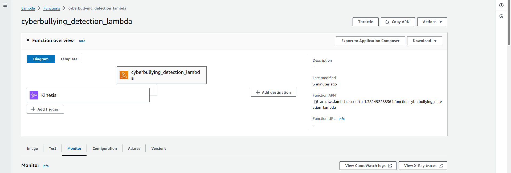
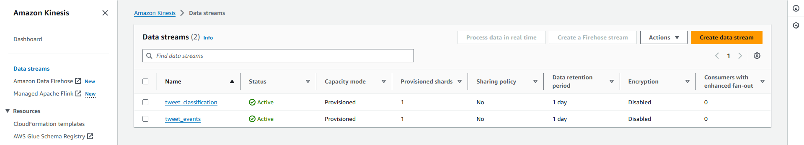

## Terraform Infrastructure Setup

Create a [S3 bucket](https://docs.aws.amazon.com/AmazonS3/latest/userguide/creating-bucket.html) named: `tf-state-mlops-zoomcamp-cyberbullying`
```bash
aws s3api create-bucket --bucket tf-state-mlops-zoomcamp-cyberbullying --region <your-default-aws-region> --create-bucket-configuration LocationConstraint=<your-default-aws-region>
```

Change directory to the `terraform` folder.

```bash
cd ~/cyberbullying_detection/terraform
```

You will edit `your-default-aws-region` in the file `variables.tf`. Use the same values throughout the project. 

Initiate terraform and download the required dependencies-

```bash
terraform init
```

View the Terraform plan

```bash
terraform plan -var-file=vars/prod.tfvars
```

Terraform plan should show the creation of following services -

  - A S3 bucket to store ML model artifacts 
  - A ECR repository to store ML application container
  - A Lambda function to deploy streaming ML service
  - Two Kinesis stream
    - tweet_events
    - tweet_classification
  - IAM Policies and Roles to allow connection

Apply the infra. **Note** - Billing will start as soon as the apply is complete.

```bash
terraform apply -var-file=vars/prod.tfvars
```

Once you are done with the project. Teardown the infra using-

```bash
terraform destroy -var-file=vars/prod.tfvars
```

**Note:** The infrastructure was setup a tad generously, you might not actually be fully utilizing the compute power. Feel free to reduce the instance sizes and test.

Here are the screenshots of resources which are created by Terraform:

- S3 bucket:



- ECR repository:



- Container image:



- Lambda function:



- Kinesis streams:

