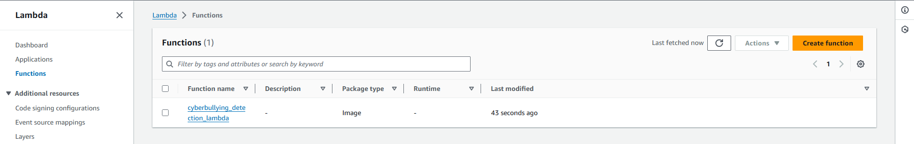
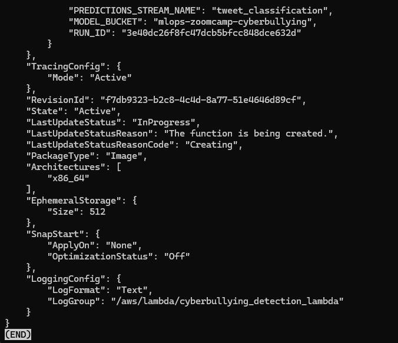
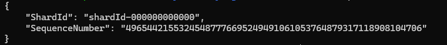

## Deploy streaming services

The deployment is done using AWS Lambda and Amazon Kinesis. We deploy the docker image to AWS ECR which is used by the AWS Lambda function. The AWS Lambda function is invoked by the Amazon Kinesis. We have an AWS Lambda named `cyberbullying_detection_lambda` and 2 Kinesis streams: `tweet_events` and `tweet_classification`.

`tweet_events` stream receives information about tweet (`tweet_text` and `tweet_id`) from any producer and send them to Lambda function and trigger it.

Lambda function will get model artifacts from S3 bucket `mlops-zoomcamp-cyberbullying` based on `RUN_ID`, then it perform classification on `tweet_text`, return the classfication result, then sends results (`tweet_id` and `classification`) to `tweet_classification` stream (which will be consumed by any consumer).

To deploy our model, we'll need to create model service `model.py` and a function script `lambda_function.py`. Also, create python environment file `Pipfile` and `Pipfile.lock` with all the dependencies. Then we'll create a docker image and push it to AWS ECR. Lambda function will be created from the container image in AWS ECR. Lambda function will be triggered by the `tweet_events` stream and it will send results to the `tweet_classification` stream. These streams are deployed by Amazon Kinesis.

All the deployment related code is located in the `deployment` directory.

Change directory to `main` folder

```bash
cd ~/cyberbullying_detection
```

Perform unit tests and integrations tests to test the model.

```bash
make tests
```

Run below script to add environment variables to AWS Lambda to run streaming service.

```bash
bash setup/deploy_manual.sh
```

Run below script to test the streaming deployment

```bash
bash setup/test_cloud_e2e.sh
```

Below is the screenshot of the Lambda function:




Here are streams which are created by using Terraform.


Here is the result when we add environment variables to AWS Lambda.



Below are result when we send data to `tweet_events` stream.




